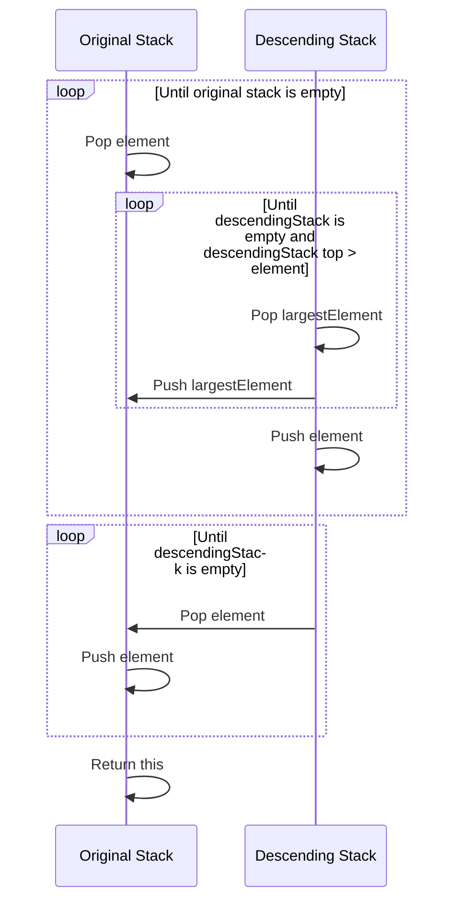

## Sort stack

```mermaid
sequenceDiagram
    participant stack as Original Stack
    participant descendingStack as Descending Stack

    loop Until original stack is empty
        stack->>stack: Pop element

        loop Until descendingStack is empty and descendingStack top > element
            descendingStack->>descendingStack: Pop largestElement
            descendingStack->>stack: Push largestElement
        end

        descendingStack->>descendingStack: Push element
    end

    loop Until descendingStack is empty
        descendingStack->>stack: Pop element
        stack->>stack: Push element
    end

    stack->>stack: Return this
```
